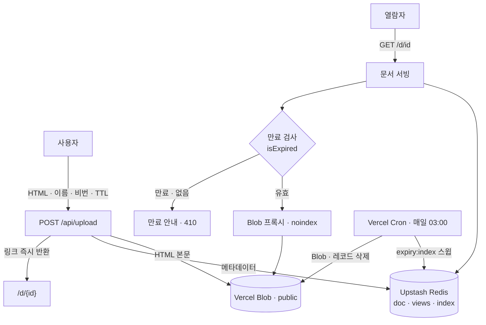

# TTL HTML Share

> 단일 HTML 파일을 올리면 **즉시 공유 링크**가 생기고, 지정한 **TTL이 지나면 자동 만료**되는 공유 서비스.

**🔗 라이브 데모: [docs.scent-jo.dev](https://docs.scent-jo.dev)**

## 소개

리포트·대시보드 같은 산출물을 단일 HTML로 만들어 팀에 공유하는 일이 잦습니다. 파일을 직접 주고받는 대신, **올리는 즉시 링크로 공유**하고 **일정 기간 뒤 자동 정리**되도록 만든 서비스입니다.

서비스는 **한 번만 배포**해두고, 업로드는 스토리지 저장만으로 처리합니다 — 매 업로드마다 재배포하지 않습니다. 링크는 저장 즉시 생성됩니다.

## 주요 기능

- **즉시 링크 생성** — HTML을 올리면 바로 `/d/{id}` 공유 링크 발급
- **드래그앤드롭 업로드** — 끌어다 놓거나 클릭, HTML·용량(10MB) 검증
- **TTL 자동 만료** — 1일 / 7일 / 30일 / 영구 (기본 7일)
- **비밀번호 관리** — 문서별 비밀번호로 유효기간 연장·즉시 삭제
- **문서 목록** — `/docs`에서 등록된 문서를 최신순으로 열람
- **조회수 집계** — 문서별 열람 횟수 기록
- **안전한 서빙** — 모든 문서에 `X-Robots-Tag: noindex`로 검색 색인 차단
- **자동 청소** — 만료 문서를 매일 cron이 정리(Blob·메타 동시 삭제)
- **악용 완화** — IP 기준 업로드 레이트리밋, scrypt 비밀번호 해시

## 동작 방식

HTML 본문은 **Vercel Blob**(public)에, 메타데이터(이름·비밀번호 해시·만료시각·조회수)는 **Upstash Redis**에 저장합니다. 만료는 ① 열람 시 게으른 검사 ② 매일 cron 청소의 2중 구조로 처리합니다.



## 기술 스택

| 영역 | 사용 |
|---|---|
| 프레임워크 | Next.js (App Router, Node.js 런타임) |
| 스타일 | Tailwind CSS 4 (CSS-first) |
| HTML 저장 | Vercel Blob (public store) |
| 메타·만료·레이트리밋 | Upstash Redis |
| 스케줄러 | Vercel Cron (`vercel.ts`) |
| Toast | sonner |
| 테스트 | Vitest |

## 빠른 시작

```bash
git clone https://github.com/pcjo1202/TTL-HTML-share.git
cd TTL-HTML-share
npm install

cp .env.example .env.local   # 값을 채워 넣으세요 (아래 표)
npm run dev                  # http://localhost:3000
```

### 환경 변수

| 변수 | 용도 |
|---|---|
| `BLOB_READ_WRITE_TOKEN` | HTML 파일 저장·삭제 (Vercel Blob 연동 시 자동 주입) |
| `UPSTASH_REDIS_REST_URL` / `..._TOKEN` | Redis 연결 — `KV_REST_API_URL` / `..._TOKEN` 이름도 그대로 허용 |
| `CRON_SECRET` | 만료 청소 cron 인증 (16자 이상 랜덤) |

> Vercel에 배포되어 있으며, GitHub `main` push 시 자동 배포됩니다. 스토리지·cron 연동 등 배포 환경 세부 사항은 [`CLAUDE.md`](./CLAUDE.md)를 참고하세요.

## 프로젝트 구조

```
src/
  lib/    순수 로직 — store(Redis+Blob CRUD) · ttl · password · id · ratelimit ...
  app/    라우트 — page(업로드) · docs(목록 SSR) · d/[id](서빙·관리) · api/*
tests/    src 트리를 미러링한 단위 테스트 (@/ 별칭 = ./src)
```

## 스크립트

```bash
npm run dev     # 개발 서버
npm run build   # 프로덕션 빌드
npm run lint    # eslint
npm run test    # vitest (전체)
```

---

> 의존성은 `@latest`로 유지하며 버전을 고정하지 않습니다.
